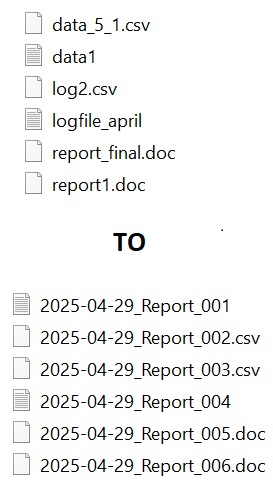

# 🗂 Report File Renamer

Batch renames messy report files to a clean format: YYYY-MM-DD_Report_###.ext

## ✅ Features

- Renames files using today’s date
- Writes output to a separate folder

## ▶️ How to Run

```bash
python file_renamer.py
```

## 📁 Files

- raw_reports/ (input)
- renamed_reports/ (output)
- file_renamer.py
- example.png (file naming preview)

## 📸 Preview

